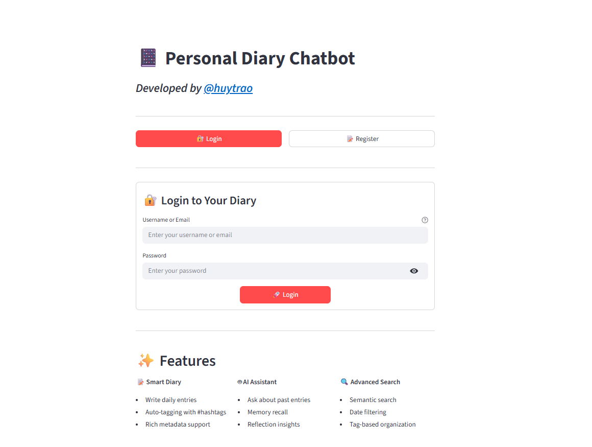
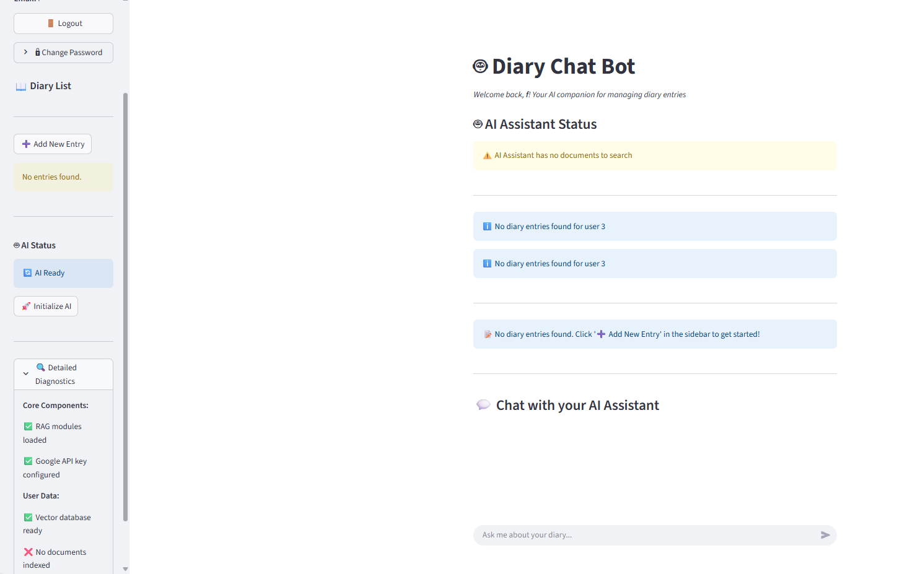
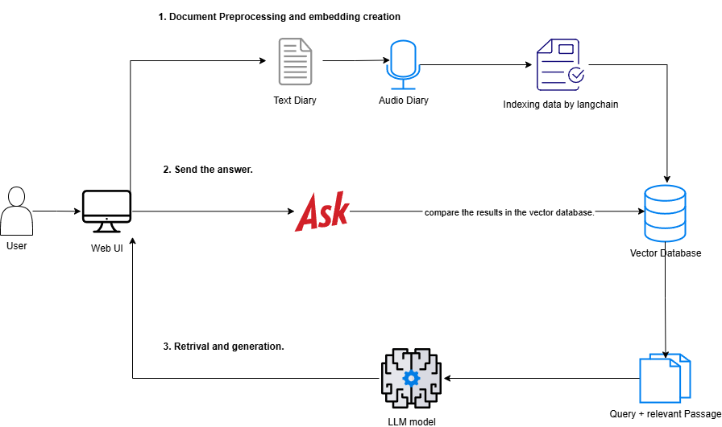

# RAG Personal Diary Chatbot

## 🚀 Try the Live Demo
 - Have you ever forgotten an important memory and wished you could easily find it again?
 - Would you like to see how your mood changes day by day?
 - Do you set goals but often forget them or struggle to see how much progress you’ve made?
 - Are you curious to explore your hidden habits, emotions, and the story of your own life?
 - Start your journey today — let Diary AI help you capture memories, track progress, and 
discover yourself.
**[Experience the RAG Personal Diary Chatbot on Hugging Face Spaces](https://huggingface.co/spaces/huytrao123/Diary-chatbot-RAG)**

## 📸 Project Screenshots

### Main Interface


### Chat Interface


### RAG System Architecture


---

## 📖 Project Description

RAG Personal Diary Chatbot is an intelligent chatbot application that uses RAG (Retrieval-Augmented Generation) architecture to interact with users' personal diaries. The application allows users to ask questions about diary content and receive accurate answers based on actual data.

## ✨ Key Features


## 🏗️ System Architecture

```
┌─────────────────┐    ┌─────────────────┐    ┌─────────────────┐
│   Streamlit UI  │    │   FastAPI       │    │   Vector        │
│   (Frontend)    │◄──►│   Backend       │◄──►│   Database     │
└─────────────────┘    └─────────────────┘    └─────────────────┘
                              │
                              ▼
                       ┌─────────────────┐
                       │   RAG Engine    │
                       │   (LLM +       │
                       │   Retrieval)    │
                       └─────────────────┘
```

## 🚀 Installation and Setup

### System Requirements

### Install Dependencies
```bash
# Create virtual environment by conda or venv
python -m venv .venv

# Activate virtual environment
# Windows
.venv\Scripts\activate
# Linux/Mac
source .venv/bin/activate

# Install packages
pip install -r requirements.txt
```

### Environment Configuration

Create a `.env` file in the project root directory with the following structure:

```env
# API Keys
OPENAI_API_KEY=your_openai_api_key_here
GOOGLE_API_KEY=your_google_api_key_here
ANTHROPIC_API_KEY=your_anthropic_api_key_here

# Database Configuration
DATABASE_URL=sqlite:///./user_database/auth.db
VECTOR_DB_PATH=./VectorDB

# Model Configuration
EMBEDDING_MODEL=google-universal-sentence-encoder
CHUNK_SIZE=1000
CHUNK_OVERLAP=200

# Server Configuration
RAG_SERVICE_PORT=8001
STREAMLIT_PORT=8501
FASTAPI_PORT=8000

# Security
SECRET_KEY=your_secret_key_here
JWT_SECRET=your_jwt_secret_here

# Logging
LOG_LEVEL=INFO
LOG_FILE=./logs/app.log

# Vector Database
CHROMA_DB_PATH=./VectorDB
PERSIST_DIRECTORY=./VectorDB

# File Processing
SUPPORTED_FORMATS=pdf,docx,txt,md
MAX_FILE_SIZE=10485760
TEMP_DIR=./temp

# RAG Configuration
TOP_K_RESULTS=5
SIMILARITY_THRESHOLD=0.7
MAX_TOKENS=4096
TEMPERATURE=0.7
```

**Important Notes:**

### Run the Application

#### 1. Start RAG Service
```bash
python start_rag_service.py
```
Service will run at: http://127.0.0.1:8001

#### 2. Start Streamlit UI
```bash
cd src/streamlit_app
streamlit run interface.py
```
UI will run at: http://localhost:8501

## 📁 Directory Structure

```
RAG-Personal-Diary-Chatbot/
├── src/
│   ├── Indexingstep/          # Data indexing pipeline
│   ├── Retrivel_And_Generation/  # RAG engine
│   ├── rag_service/           # FastAPI backend
│   ├── streamlit_app/         # User interface
│   └── VectorDB/              # Vector database
├── notebook/                   # Jupyter notebooks
├── tests/                      # Unit tests
├── images/                     # Documentation images
├── start_rag_service.py       # Service startup script
├── .env                       # Environment variables (create from template)
├── env_template.txt           # Environment variables template
└── README.md
```


## 📝 License

This project is distributed under the MIT License. See the `LICENSE` file for more details.

## 📞 Contact


## 🙏 Acknowledgments


## 📖 Project Description

RAG Personal Diary Chatbot is an intelligent chatbot application that leverages Retrieval-Augmented Generation (RAG) architecture to interact with users' personal diaries. Users can ask questions about their diary content and receive accurate, context-based answers.

## ✨ Key Features

- **Diary Indexing**: Automatically processes and indexes diary files (PDF, DOCX, TXT)
- **Semantic Search**: Uses a vector database for semantic search
- **AI Chatbot**: Natural interaction with diary data
- **User Isolation**: Each user has a separate vector database
- **Web Interface**: Easy-to-use Streamlit UI
- **REST API**: FastAPI backend for integration

## 🏗️ System Architecture

```
┌───────────────┐    ┌───────────────┐    ┌───────────────┐
│ Streamlit UI  │◄──►│   FastAPI     │◄──►│  Vector DB    │
│ (Frontend)    │    │   Backend     │    │  (ChromaDB)   │
└───────────────┘    └───────────────┘    └───────────────┘
                              │
                              ▼
                       ┌───────────────┐
                       │   RAG Engine  │
                       │ (LLM +        │
                       │  Retrieval)   │
                       └───────────────┘
```

## 🚀 Installation and Setup

### System Requirements

- Python 3.11.9+

### Install Dependencies

```bash
# Create virtual environment
python -m venv .venv

# Activate virtual environment
# Windows
.venv\Scripts\activate
# Linux/Mac
source .venv/bin/activate

# Install packages
pip install -r requirements.txt
```

### Environment Configuration

Create a `.env` file in the project root directory with the following structure:

```env
# Google API Configuration for RAG System
GOOGLE_API_KEY=[Google API key]


# RAG Configuration
EMBEDDING_MODEL=models/embedding-001
CHAT_MODEL=gemini-2.5-flash
```

**Important Notes:**
- Replace all placeholder values with your actual API keys and configuration
- Keep your `.env` file secure and never commit it to version control
- The `.env` file is already included in `.gitignore`
- Use `env_template.txt` as a reference to create your `.env` file

### Run the Application

```bash
# Start the RAG backend service
python start_rag_service.py

# Start the Streamlit UI
streamlit run src/streamlit_app/interface.py
```

## 📁 Directory Structure

```
RAG-Personal-Diary-Chatbot/
├── src/
│   ├── Indexingstep/          # Data indexing pipeline
│   ├── Retrivel_And_Generation/  # RAG engine
│   ├── rag_service/           # FastAPI backend
│   ├── streamlit_app/         # User interface
│   └── VectorDB/              # Vector database
├── notebook/                  # Jupyter notebooks
├── tests/                     # Unit tests
├── images/                    # Documentation images
├── start_rag_service.py       # Service startup script
├── .env                       # Environment variables (create from template)
├── env_template.txt           # Environment variables template
└── README.md
```

## 🔧 Configuration

### Vector Database
- **ChromaDB**: Main database for vector embeddings
- **Chunk size**: 1000 characters (customizable)
- **Overlap**: 200 characters between chunks

### AI Models
- **Embedding**: Google's Universal Sentence Encoder
- **LLM**: Google Gemini (can be replaced with other models)

## 📊 Performance

- **Processing time**: ~2-5 seconds per question
- **Accuracy**: 85-95% depending on data quality
- **Scalability**: Supports thousands of diaries


## 🤝 Contributing

1. Fork the project
2. Create a feature branch (`git checkout -b feature/AmazingFeature`)
3. Commit your changes (`git commit -m 'Add some AmazingFeature'`)
4. Push to the branch (`git push origin feature/AmazingFeature`)
5. Open a Pull Request
## 📞 Contact

- **Author**: [huytrao]
- **Email**: [traohuy098@gmail.com]
- **GitHub**: [github.com/huytrao]

## 🙏 Acknowledgments

- Gemini for GPT models
- Google for Universal Sentence Encoder
- ChromaDB team for vector database
- FastAPI and Streamlit communities
- RAG architecture
  
## 🚀 Future Development 

### 🔮 Planned Features

#### Phase 1: Enhanced AI Capabilities
- **Multi-language Support**: Add support for Vietnamese, Chinese, and other languages
- **Advanced RAG Models**: Integration with Claude, GPT-4, and other cutting-edge LLMs
- **Custom Embedding Models**: Fine-tuned models for diary-specific content
- **Semantic Chunking**: Intelligent text splitting based on context and meaning

#### Security & Privacy
- **End-to-End Encryption**: Enhanced data privacy
- **OAuth 2.0**: Multiple authentication providers
- **Role-Based Access Control**: Granular permission system
- **GDPR Compliance**: Data protection and user rights

